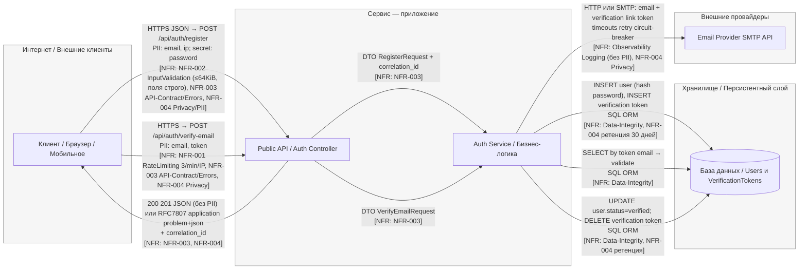

# TM - Требования безопасности + Модель угроз + ADR

---

## 0) Мета

- **Проект :** учебный шаблон
- **Версия :** v1 / 2025-10-12
- **Кратко :** Онлайн магазин для b2с сегмента

---

## 1) Архитектура и границы доверия (TM1, S04)

- **Роли/активы:**  клиенты (браузер, мобильные устройства), админ; PII (email, IP), а также токены для верификации и пароли (хешированные)
- **Зоны доверия:** Internet (Внешний доступ через API, публичные эндпоинты)/ DMZ / Internal (Сервисная логика, базовые данные, внешние провайдеры, например почта / Storage (База данных для хранения пользователей и токенов)
- **Context/DFD:**

- **Критичные интерфейсы и допущения:**  
  Доверенные: API gateway, сервисы внутри приложения, авторизация, база данных. 
  Недоверенные: Клиенты (внешние), внешний почтовый провайдер.

---

## 2) Реестр угроз STRIDE (TM2, TM3, S04)

_Минимум: закрыть все буквы **S, T, R, I, D, E**. Оценки **L/I** по шкале 1-5._

| ID  | STRIDE | Компонент/поток | Угроза (кратко)                                   | L   | I   | L×I |
|-----|--------|------------------|----------------------------------------------------|-----|-----|-----|
| T01 | **D**  | Internet→API (/verify-email, /register)             | Abuse/DoS публичных auth-эндпоинтов     | 4   | 4   | 16  |
| T02 | **I**  | API/Service Logs & Errors, API→Client          | Утечка PII через логи и ответы:                  | 4   | 4   | 16  |
| T03 | **R**  | Audit            | Отказ от действий: нет связки user↔action          | 3   | 3   | 9   |
| T04 | **I**  | S1 → DB          | Инъекции/невалидный ввод                           | 2   | 5   | 10  |
| T05 | **D**  | S1               | DoS/ресурсное истощение без лимитов/таймаутов      | 4   | 4   | 16  |
| T06 | **E**  | Repo/Secrets     | Секреты в коде/логах                               | 2   | 5   | 10  |
| …   | …      | …                | …                                                  | …   | …   | …   |

---

## 3) Приоритизация и Top-5 _(TM3, S04)_

1) **T05 DoS** - L×I=16; публичная экспозиция; нет лимитов/таймаутов.  
2) **T01 Abuse/DoS публичных auth-эндпоинтов** - Почему: публичная поверхность, простая автоматизация → L=4; блокирует ключевой путь онбординга → I=4.  
3) **T02 PII-утечки через логи/ошибки** - L×I=16; Почему: часто встречается и масштабируемо (массовые логи) → L=4; приватность/комплаенс-удар → I=4.  
4) **T06 Секреты** - L×I=10; риск утечек/эскалации.  
5) **T03 Отказ от действий** - L×I=9; требуется трассируемость.  

> TODO: если меняете порядок - укажите 1-2 фактора (экспозиция/чувствительность/частота/обнаружимость).

---

## 4) Требования (S03) и ADR-решения (S05) под Top-5 (TM4)

### NFR-001. Защита от DDoS/Грязных данных

- **AC (GWT):**
  - **Given** ip адрес  **When** выполняется limit+N запросов к <endpoint> за 60 секунд  **Then** лишние запросы получают 429 и корректный заголовок Retry-After
  - **Given** тело запроса размером 128 KiB **When** `POST /api/auth/register` **Then** ответ **413** с телом в RFC 7807 
  - **Given** тело с незадекларированным полем `debug` **When** `POST /api/auth/register` **Then** **400** в RFC 7807; схема DTO отклоняет неизвестные поля.

### NFR-002. Отсутствие утечек/Приватность/комплаенс

- **AC (GWT):**
  - **Given** серверная ошибка при `POST /api/auth/register` **When** клиент получает ответ **Then** `Content-Type=application/problem+json`, присутствуют `type/title/status/detail`, нет стэктрейсов, есть `correlation_id`
  - **Given** бизнес-ошибка в `POST /api/auth/verify-email` **Then** тело также соответствует RFC 7807.
  - **Given** DTO с `email` и `ip` **When** выполняется логирование на любом уровне **Then** поля PII замаскированы/отсутствуют; 
  - **Given** учётная запись осталась неподтверждённой **When** проходит 30 дней **Then** запись и связанный verification-токен удаляются согласно политике ретенции; наличие задания ретенции проверяемо.

### NFR-3. Аудит критических операций

- **AC (GWT):** логируется `correlation_id`, uid, время и результат для операций (`login`, `role_change`, `data_export`, …).

> TODO: при необходимости добавьте свои NFR под Top-5.

---

### Краткие ADR (минимум 2) - архитектурные решения S05

(карточки короткие, по делу)

#### ADR-001 - Global & per-route rate-limits + body-size limits

- **Context (угрозы/NFR):** T01, NFR-001; Защита от DDoS/Грязных данных
- **Decision:** Внедрение глобальных лимитов на количество запросов и размер тела на уровне всех auth-эндпоинтов
- **DoD (готовность):** **When**: Запросы превышают лимит по размеру или количеству ( более 64 KiB или 10 запросов/мин).
**Then**: Клиент получает ответ 429 с корректным заголовком `Retry-After`.
- **Owner:** Аношенко.Д.С.
- **Evidence (план/факт):** SEMINARS/S05_ADR_rate-limiting-auth.md

#### ADR-002 - TODO: название

- **Context:** T05, NFR-2; публичные endpoint’ы
- **Decision:** rate-limit на GW + server-side timeouts; backpressure
- **Trade-offs:** возможные 429 и влияние на UX
- **DoD:** срабатывание 429 при >N rps; p95 ≤ T сек
- **Owner:** ФИО/роль
- **Evidence (план/факт):** EVIDENCE/load-after.png

---

## 5) Трассировка Threat → NFR → ADR → (План)Проверки (TM5)

| Threat | NFR     | ADR     | Чем проверяем (план/факт)                                                                        |
|-------:|---------|---------|--------------------------------------------------------------------------------------------------|
| T01    | NFR-001 | ADR-001 | e2e-тесты на лимит запроса и тела. Проверка на соответствие конфигурации лимитов в API Gateway. Слежение за количеством 429 ответов, недопущение превышения 5% от всех запросов. |
| T05    | NFR-2   | ADR-002 | Нагрузочный тест + проверка 429/таймаутов → EVIDENCE/load-after.png                              |
| T04    | NFR-X   | ADR-00X | SAST/линтер на инъекции/параметризацию → EVIDENCE/sast-YYYY-MM-DD.pdf#sql-1                      |
| T03    | NFR-3   | ADR-00Y | Анализ образцов аудита → EVIDENCE/audit-sample.txt#corrid                                        |

> TODO: заполните таблицу для ваших Top-5; верификация может быть «планом», позже артефакты появятся в DV/DS.

---

## 6) План проверок (мост в DV/DS)

- **SAST/Secrets/SCA:** TODO: инструменты и куда положите отчёты в `EVIDENCE/`
- **SBOM:** TODO: генератор/формат
- **DAST (если применимо):** TODO: стенд/URL; профиль
- **Примечание:** на этапе TM допустимы черновые планы/ссылки; финальные отчёты появятся в **DV/DS**.

---

## 7) Самопроверка по рубрике TM (0/1/2)

- **TM1. Архитектура и границы доверия:** [ ] 0 [ ] 1 [ ] 2  
- **TM2. Покрытие STRIDE и уместность угроз:** [ ] 0 [ ] 1 [ ] 2  
- **TM3. Приоритизация и Top-5:** [ ] 0 [ ] 1 [ ] 2  
- **TM4. NFR + ADR под Top-5:** [ ] 0 [ ] 1 [ ] 2  
- **TM5. Трассировка → (план)проверок:** [ ] 0 [ ] 1 [ ] 2  

**Итог TM (сумма):** __/10
