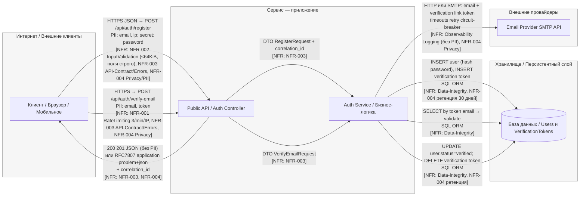
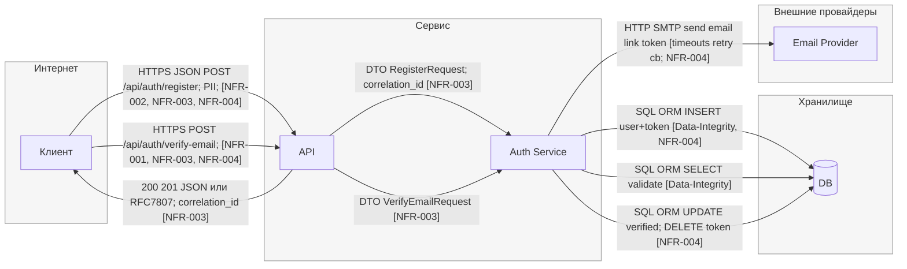

## DFD

## STRIDE

| Element                                  | Data/Boundary                         | Threat (S/T/R/I/D/E) | Description                                                                     | NFR link (ID)                                 | Mitigation idea (ADR later)                          |
| ---------------------------------------- | ------------------------------------- | -------------------: | ------------------------------------------------------------------------------- | --------------------------------------------- | ---------------------------------------------------- |
| **Boundary: Internet ↔ Service**         | TLS, public                           |                    S | Подмена сервера/клиента при неверной TLS-конфигурации (downgrade/invalid cert). | need NFR: Security-TLS                        | Enforce TLS1.2+, HSTS, cert pinning (mobile)         |
| Boundary: Internet ↔ Service             | TLS, public                           |                    I | Утечка данных при отключенном/слабом TLS.                                       | need NFR: Security-TLS                        | TLS hardening baseline                               |
| **Edge: Internet → API (/register)**     | HTTPS JSON, PII (email, ip), password |                    T | Подделка/засорение тела: лишние поля, превышение размера, некорректные типы.    | **NFR-002**                                   | Strict DTO schema, max body 64KiB, 400/413           |
| Edge: Internet → API (/register)         | HTTPS JSON, public                    |                    D | DoS большим числом запросов/большими телами на /register.                       | **NFR-002**, **need NFR: RateLimit-register** | Body size limit + global rate limit /register        |
| Edge: Internet → API (/register)         | API errors                            |                    I | Подробные ошибки раскрывают внутренности (stack traces, схемы).                 | **NFR-003**                                   | RFC7807, без стэктрейсов, correlation_id             |
| **Edge: Internet → API (/verify-email)** | HTTPS JSON, PII (email), token        |                    S | Брутфорс/повтор токена подтверждения (replay/guess).                            | need NFR: Token-Entropy/TTL                   | High-entropy token, short TTL, bind to email+purpose |
| Edge: Internet → API (/verify-email)     | public endpoint                       |                    D | Злоупотребление эндпоинтом (флуд) для истощения ресурса.                        | **NFR-001**                                   | 3/min/IP + 429 Retry-After                           |
| Edge: Internet → API (/verify-email)     | API errors                            |                    I | Ошибки выдают, существует ли email (email enumeration).                         | **NFR-003**, **NFR-004**                      | Универсальные ответы для существ/не существ, RFC7807 |
| **Node: API (Controller/Gateway)**       | Request headers, IP                   |                    T | Доверие к `X-Forwarded-For`/proxy без белого списка — обход rate limit.         | need NFR: Trusted-Proxies                     | Trust proxy chain, real IP from gateway only         |
| Node: API                                | Logging/metrics                       |                    R | Отсутствие трассировки запроса затрудняет разбор инцидентов.                    | **NFR-003**                                   | Correlation_id в контексте и логах                   |
| Node: API                                | Logging/PII                           |                    I | Логирование сырых PII (email, ip, token).                                       | **NFR-004**                                   | Маскирование/редакция PII в логах                    |
| **Edge: API → Service**                  | DTO Register/Verify                   |                    T | Обход бизнес-валидации при неполной проверке схемы/статуса.                     | **NFR-002**                                   | Central DTO validation + state checks                |
| Edge: API → Service                      | Internal call                         |                    R | Нет аудита кто/что инициировал изменение статуса пользователя.                  | need NFR: Auditability                        | Audit event “user_verified” с актором и временем     |
| **Node: Service (Auth Service)**         | Business logic                        |                    S | Прямой доступ к команде “verify” без проверки токена (внутренний обход).        | need NFR: Internal-AuthZ                      | AuthZ на внутренние команды/ручки                    |
| Node: Service                            | State machine                         |                    T | Неверные переходы состояния (повторная верификация, гонки).                     | need NFR: Idempotency/State                   | Idempotency key, проверка текущего статуса           |
| Node: Service                            | Audit/Logs                            |                    R | Нет аудита генерации/погашения токенов.                                         | need NFR: Auditability                        | Audit trail для create/use/revoke token              |
| Node: Service                            | Errors/PII                            |                    I | Ошибки сервиса включают PII/секреты (например, части токена).                   | **NFR-003**, **NFR-004**                      | Problem+json без секретов, redaction hooks           |
| Node: Service                            | Resources                             |                    D | Неосвобождение ресурсов при внешних зависаниях → thread pool exhaustion.        | need NFR: Timeouts/CB                         | Global timeouts, circuit breaker, bulkhead           |
| **Edge: Service ↔ DB**                   | SQL/ORM                               |                    T | SQLi/манипуляция запросами при слабой параметризации.                           | **NFR-002**, need NFR: ORM-Params             | Parameterized queries, ORM safe API                  |
| Edge: Service ↔ DB                       | SQL/ORM                               |                    R | Нет следов кто и когда изменил запись пользователя.                             | need NFR: DB-Audit                            | DB audit (trigger/CDC) для критичных таблиц          |
| Edge: Service ↔ DB                       | Users, Tokens                         |                    I | Избыточный доступ/`SELECT *` → утечка лишних колонок PII.                       | **NFR-004**, need NFR: Least-Privilege        | Узкие SELECT/проекции, разделение прав               |
| Edge: Service ↔ DB                       | Connections                           |                    D | Долгие транзакции/блокировки приводят к истощению пула.                         | need NFR: DB-Timeouts                         | Tx timeout, query timeout, индексирование            |
| **Node: DB (Users, VerificationTokens)** | Data at rest (PII)                    |                    I | PII хранится без шифрования/ретенции.                                           | **NFR-004**                                   | Retention 30d для неподтв., encryption-at-rest       |
| Node: DB                                 | Token storage                         |                    S | Токены хранятся в открытом виде и могут быть выкрадены.                         | need NFR: Token-Storage                       | Хэширование токенов (HMAC/sha256) + соль             |
| **Edge: Service → External (Email)**     | SMTP/HTTP payload                     |                    I | Лишние PII в письме/запросе провайдеру.                                         | **NFR-004**                                   | Минимизация payload, DPA с провайдером               |
| Edge: Service → External (Email)         | Network call                          |                    D | Залипание без timeout/retry/circuit breaker.                                    | need NFR: Timeouts/Retry/CB                   | Timeout≤2s, retry≤3 с джиттером, CB                  |
| Edge: Service → External (Email)         | Observability                         |                    R | Нет наблюдаемости: неясно, ушло ли письмо, нет кореляции.                       | need NFR: Observability                       | Outbound span + delivery status metrics              |
| **Edge: API → Client (responses)**       | JSON/RFC7807                          |                    I | Возврат детальной причины (например, “email exists”) раскрывает состояние.      | **NFR-003**, **NFR-004**                      | Нейтральные сообщения, одинаковые статусы            |
| Edge: API → Client (responses)           | Public                                |                    S | Подмена ответа в кеше/по пути при неверных cache headers.                       | need NFR: Caching-Security                    | `Cache-Control: no-store` для чувствительных ответов |
| **Boundary: Service ↔ External**         | Trust boundary                        |                    E | Злоумышленник управляет внешним SMTP и влияет на бизнес-потоки.                 | need NFR: Outbound-Policies                   | Allow-list доменов, egress policies, DNS pinning     |
| Boundary: Service ↔ Storage              | Trust boundary                        |                    E | Завышенные права сервисного аккаунта к БД (DDL/DML все права).                  | need NFR: DB-Least-Privilege                  | Principle of least privilege, отдельные роли RW      |

---