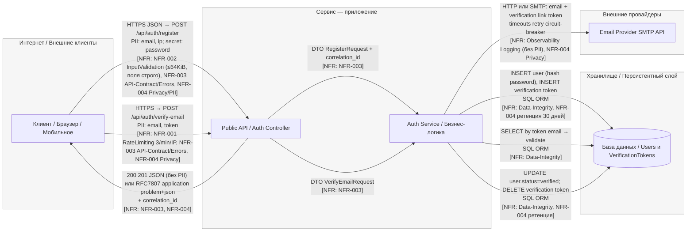
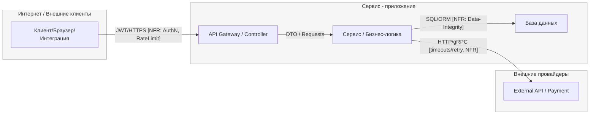

## Базовый каркас (mermaid)

> Замените названия узлов под свой контекст, добавьте/уберите узлы, подпишите типы данных на рёбрах.
> **Важно:** границы доверия оформлены как `subgraph` с единым стилем.

---