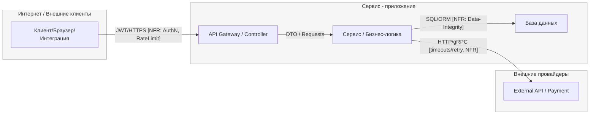

```mermaid
flowchart LR
  %% =========================
  %% Trust boundaries
  %% =========================
  subgraph Internet[Интернет / Внешние клиенты]
    U[Клиент / Браузер / Мобильное приложение]
  end

  subgraph Service[Сервис — приложение]
    A[Public API / Auth Controller]
    S[Auth Service / Бизнес-логика]
  end

  subgraph Storage[Хранилище / Персистентный слой]
    D[(База данных / Users, VerificationTokens)]
  end

  subgraph External[Внешние провайдеры]
    X[Email Provider (SMTP/API)]
  end

  classDef boundary fill:#f6f6f6,stroke:#999,stroke-width:1px;
  class Internet,Service,Storage,External boundary;

  %% =========================
  %% Основные потоки и контроли
  %% =========================

  %% Регистрация
  U -- "HTTPS/JSON → POST /api/auth/register\nPII: email, ip; secret: password\n[NFR: NFR-002 InputValidation (≤64KiB, поля строго), NFR-003 API-Contract/Errors, NFR-004 Privacy/PII]" --> A
  A -->|"DTO(RegisterRequest) + correlation_id\n[NFR: NFR-003]"| S
  S -->|"INSERT user (hash(password)), INSERT verification_token\nSQL/ORM\n[NFR: Data-Integrity, NFR-004 ретенция 30 дней для неподтв.]"| D

  %% Отправка письма подтверждения
  S -->|"HTTP/SMTP: email + verification_link/token\ntimeouts/retry/circuit-breaker\n[NFR: Observability/Logging (без PII в логах), NFR-004 Privacy]"| X

  %% Подтверждение email
  U -- "HTTPS → POST /api/auth/verify-email\nPII: email, token\n[NFR: NFR-001 RateLimiting 3/min/IP, NFR-003 API-Contract/Errors, NFR-004 Privacy]" --> A
  A -->|"DTO(VerifyEmailRequest)\n[NFR: NFR-003]"| S
  S -->|"SELECT by token/email → validate\nSQL/ORM\n[NFR: Data-Integrity]"| D
  S -->|"UPDATE user.status=verified; DELETE verification_token\nSQL/ORM\n[NFR: Data-Integrity, NFR-004 ретенция]"| D

  %% Ответы наружу (контракт ошибок/успех)
  A -- "200/201 JSON (без PII),\nили RFC7807 application/problem+json\n+ correlation_id\n[NFR: NFR-003, NFR-004]" --> U

```


## Базовый каркас (mermaid)

> Замените названия узлов под свой контекст, добавьте/уберите узлы, подпишите типы данных на рёбрах.
> **Важно:** границы доверия оформлены как `subgraph` с единым стилем.



---