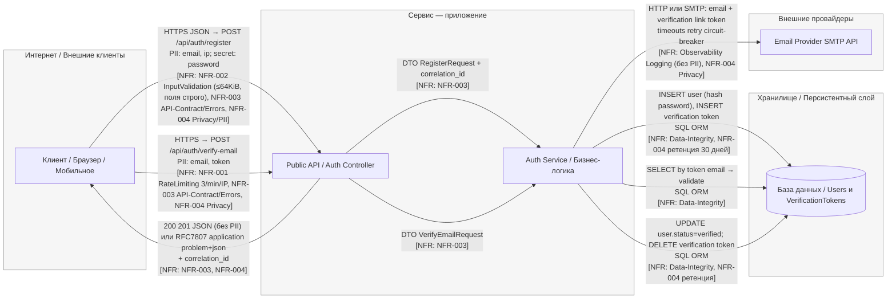
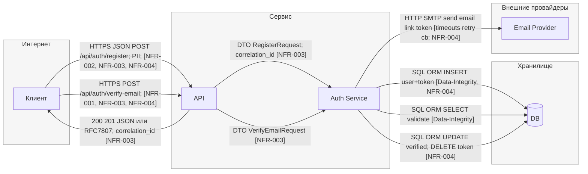

## DFD

```mermaid
flowchart LR
  %% === Trust boundaries ===
  subgraph Internet["Интернет / Внешние клиенты"]
    U[Клиент / Браузер / Мобильное]
  end

  subgraph Service["Сервис — приложение"]
    A[Public API / Auth Controller]
    S[Auth Service / Бизнес-логика]
  end

  subgraph Storage["Хранилище / Персистентный слой"]
    D[(База данных / Users и VerificationTokens)]
  end

  subgraph External["Внешние провайдеры"]
    X[Email Provider SMTP API]
  end

  %% === Основные потоки ===
  U -- "HTTPS JSON → POST /api/auth/register<br/>PII: email, ip; secret: password<br/>[NFR: NFR-002 InputValidation (≤64KiB, поля строго), NFR-003 API-Contract/Errors, NFR-004 Privacy/PII]" --> A
  A -->|"DTO RegisterRequest + correlation_id<br/>[NFR: NFR-003]"| S
  S -->|"INSERT user (hash password), INSERT verification token<br/>SQL ORM<br/>[NFR: Data-Integrity, NFR-004 ретенция 30 дней]"| D

  S -->|"HTTP или SMTP: email + verification link token<br/>timeouts retry circuit-breaker<br/>[NFR: Observability Logging (без PII), NFR-004 Privacy]"| X

  U -- "HTTPS → POST /api/auth/verify-email<br/>PII: email, token<br/>[NFR: NFR-001 RateLimiting 3/min/IP, NFR-003 API-Contract/Errors, NFR-004 Privacy]" --> A
  A -->|"DTO VerifyEmailRequest<br/>[NFR: NFR-003]"| S
  S -->|"SELECT by token email → validate<br/>SQL ORM<br/>[NFR: Data-Integrity]"| D
  S -->|"UPDATE user.status=verified; DELETE verification token<br/>SQL ORM<br/>[NFR: Data-Integrity, NFR-004 ретенция]"| D

  A -- "200 201 JSON (без PII) или RFC7807 application problem+json<br/>+ correlation_id<br/>[NFR: NFR-003, NFR-004]" --> U

  %% --- Оформление границ ---
  classDef boundary fill:#f6f6f6,stroke:#999,stroke-width:1px;
  class Internet,Service,Storage,External boundary;

```

```mermaid
flowchart LR
  subgraph Internet["Интернет"]
    U[Клиент]
  end
  subgraph Service["Сервис"]
    A[API]
    S[Auth Service]
  end
  subgraph Storage["Хранилище"]
    D[(DB)]
  end
  subgraph External["Внешние провайдеры"]
    X[Email Provider]
  end

  U -- "HTTPS JSON POST /api/auth/register; PII; [NFR-002, NFR-003, NFR-004]" --> A
  A -->|"DTO RegisterRequest; correlation_id [NFR-003]"| S
  S -->|"SQL ORM INSERT user+token [Data-Integrity, NFR-004]"| D
  S -->|"HTTP SMTP send email link token [timeouts retry cb; NFR-004]"| X
  U -- "HTTPS POST /api/auth/verify-email; [NFR-001, NFR-003, NFR-004]" --> A
  A -->|"DTO VerifyEmailRequest [NFR-003]"| S
  S -->|"SQL ORM SELECT validate [Data-Integrity]"| D
  S -->|"SQL ORM UPDATE verified; DELETE token [NFR-004]"| D
  A -- "200 201 JSON или RFC7807; correlation_id [NFR-003]" --> U

  classDef boundary fill:#f6f6f6,stroke:#999,stroke-width:1px;
  class Internet,Service,Storage,External boundary;


```

---